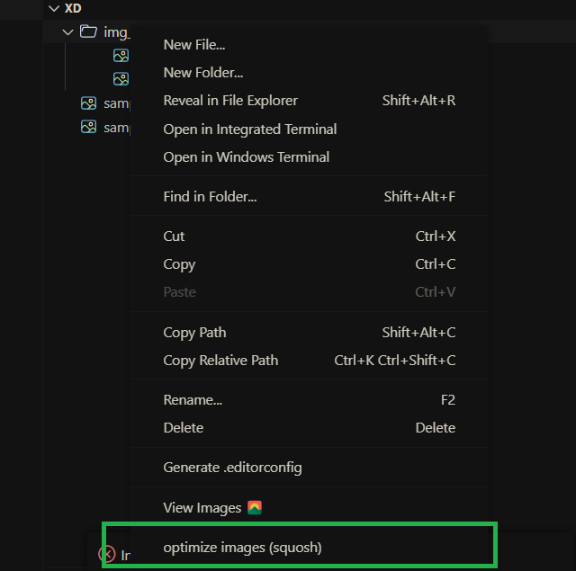
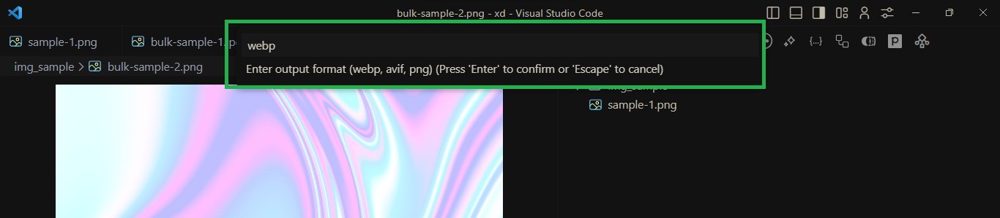
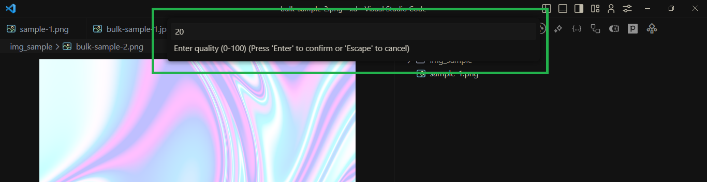

# Squoosh

Squoosh is a Visual Studio Code extension designed to optimize images right in your editor. It allows you to reduce file sizes while maintaining image quality, ensuring faster load times for your web applications.

## Features

- **Optimize Images**: Compress images in various formats including webp, avif, png, jpg, jpeg, gif, and tiff.
- **Local Processing**: Squoosh operates locally, ensuring your images never leave your device, providing an extra layer of privacy.
- **Quality Control**: Adjust the quality of the compressed images, allowing for a balance between file size and image quality.
- **Bulk Compression**: Optimize multiple images at once with a single command.
- **User-Friendly Interface**: An intuitive interface that makes image optimization a breeze.

## showcase

#### click on image file or folder with photos to compress

#### choose ouput format

#### choose quality level

#### example

<video controls src="assets/squosh.mp4" title="squosh example"></video>

## Requirements

- Visual Studio Code 1.50.0 or later
- Node.js 18.0.0 or later

## Extension Settings

This extension does not currently contribute any additional settings to the VS Code configuration.

## Known Issues

- No known issues at this time.

## Release Notes

### 1.0.0

- Initial release of Squoosh VS Code extension.
- Basic image compression functionality.

## how Works?

using sharp, it will compress images.

click on your image folder o image file, and select the options "Optimize Images (squosh)" it will compress your image.

**Enjoy using Squoosh in VS Code!**
